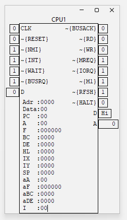

# KiCad logical scheme simulator

[KiCad](https://www.kicad.org) plugin for interactive logical scheme simulation.
Supports two usage methods: directly from KiCad or standalone, using a schema file exported from KiCad in the "PCB Netlist"(`.net`) file format.

Focuses on performance and simplicity of the net schema part API, allowing easy implementation of custom schema part behaviors for simulation.

[Here is more info](stuff%2Fkicad_symbols%2FREADME.md) about the supported schema part list and how to configure KiCad symbols mapping for the simulator.

## Building

To build the project, execute the Gradle assemble task:

```
./gradlew clean assemble
```

If the build is successful, you will find the output in the 'distro' folder.

## Standalone Start

Once you have prepared and exported the schema from KiCad in the "PCB Netlist" (`.net`) file format, you can start the project. Use the appropriate script based on
your operating system from the 'distro' directory.

For Unix-like systems:

```bash
./run.sh mySchema.net
```

For Windows systems:

```bat
run.bat mySchema.net
```

These scripts initiate the simulator with the specified `.net` file as the first parameter.

## KiCad Plugin Mode

KiCad currently supports plugins only in the PCB editor, not in the Schematic Editor (Eeschema). However, a workaround exists using BOM (Bill Of Material) scripts,
which are custom [Python](https://www.python.org) scripts that receive the path to an XML variant of the "PCB Netlist" as the first parameter. This mechanism can be
used to launch the simulator directly from the schematic editor. Add the custom BOM generation script `simulate.py` from the 'distro' directory. Then, when
you run "BOM generation" using that script, the simulator will be started instantly with the schema currently open in the editor.  
On KiCad prior version 8 BOM generations are accessed directly in the toolbar. In version 8 BOM generation has been changed and generation from a python script now
located under the menu Tools->"Generate Legacy Bill of Materials...". That can be assigned to your preferred hotkey for quick access.

## Usage

After launching the project, the simulator builds the simulation net and displays all "interactive" schema parts, such as LEDs, displays, or oscillators, on the
desk. Parts can be arranged freely, and the layout is saved near the Netlist file in a file with the `.sym_layout` extension.

For a detailed description of components, see [more information](schemaParts%2FREADME.md).

For schema debugging purposes, an [oscilloscope](schemaParts%2Foscillator%2FOSCILLOSCOPE.md) from the [oscillator](schemaParts%2Foscillator%2FREADME.md) component
can be used. Alternatively, schema part monitoring is available from the main interface menu.

After selecting a target schema part, its pin representation appears on the screen, showing the current signal on each pin. Optionally, for certain schema parts,
additional information about internal status is displayed. For example, for the Z80 CPU:



## Examples

Here are some schema Netlist examples:

- [Counters](stuff/examples/counters) - A simple chain of counters and LEDs.
- [Z80](stuff/examples/z80) - A schema based on the Zilog Z80.

## License

This project is licensed under the GNU General Public License v3.0 (GPL-3.0). You can find the full text of the license in the [LICENSE](LICENSE) file.
