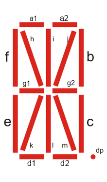

## 16 segment LED display

Interactive 16 segment LED display schema part.

### Pins

#### Input names:

- `A1`,`A2`,`B`,`C`,`D1`,`D2`,`E`,`F`,`G1`,`G2`,`H`,`I`,`J`,`K`,`L`,`M`,`DP`

#### Output names:

- none

### Parameters

#### Mandatory parameters:

- none

#### Optional parameters:

- `size`- display diagonal on desk
- `onColor`- Turned on LED color in RGB #xxxxxx
- `offColor`- Turned off LED color in RGB #xxxxxx

### Example

`size=120;onColor=#FF0000;offColor=#808080`
