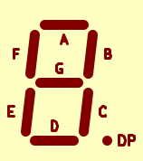

## 7 segment LED display

Interactive 7 segment LED display schema part.

### Pins

#### Input names:

- `A`,`B`,`C`,`D`,`E`,`F`,`G`,`DP` - segments input
- `CS`- chip select.
  Optional.
  In common anode mode display active at `Hi` only.
  In common cathode mode display active at `Lo` only.

#### Output names:

- none

### Parameters

#### Mandatory parameters:

- none

#### Optional parameters:

- `size`- display diagonal on a desk.
- `dpLeft`- decimal point on left side, on right otherwise.
- `commonAnode`- CS pin - common anode.
- `commonCathode`- CS pin - common cathode.
- `dpLeft`- decimal point on left side, on right otherwise.
- `onColor`- Turned on LED color in RGB #xxxxxx
- `offColor`- Turned off LED color in RGB #xxxxxx

### Example

`size=120;onColor=#FF0000;offColor=#808080`
