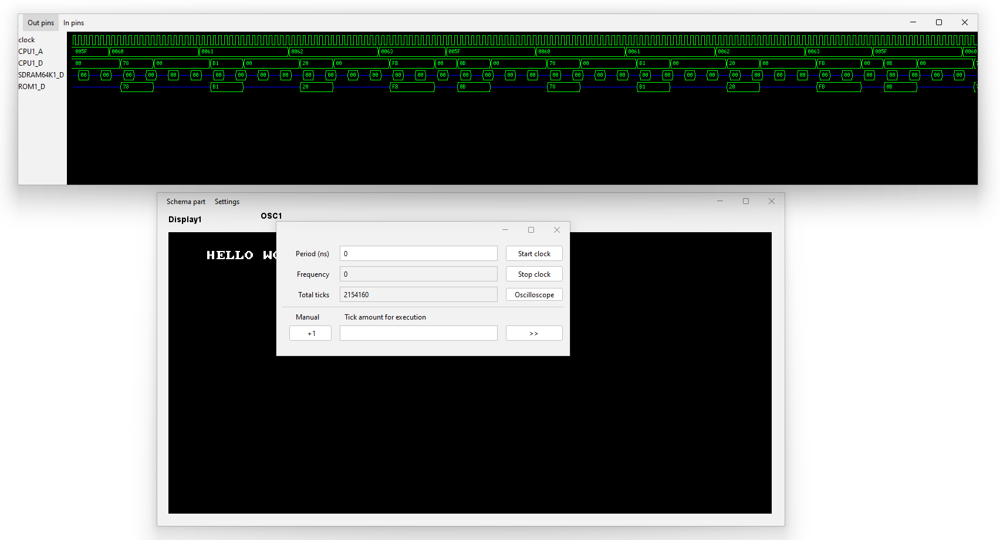

## Oscilloscope

Oscilloscope, synchronized by both fronts of an oscillator.

The oscillator output added by default.  
Additionally, any output or input can be added to the display.  
Diagrams can be navigated back and forth using the mouse wheel.  
Zooming in and out possible by holding the CTRL key while using the mouse wheel.

