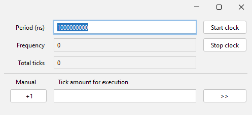

## Oscillator

Implement oscillator.

**Output names**: OUT

**Optional parameter `outName`:** If provided, define output pin name;

The schema part is interactive and opens an additional control panel on click.

There are three modes:

- **Manual mode:** Each button press toggles the oscillator output to the opposite state.
- **Automatic mode:** A period is set between output toggles. If the period is set to 0, the process starts 'as fast as possible,' generating new ticks without any
  pause after the current tick processing is complete. In this mode, the achieved oscillator frequency is displayed.
- **Processing a defined number of ticks:** Useful for debugging where an error occurs after a defined number of ticks, for example CPU containing schemas.

Either contain [oscilloscope](OSCILLOSCOPE.md) functionality;

- 

