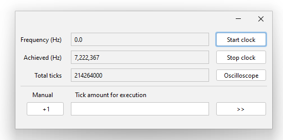

## Oscillator

### Pins

#### Input names:

- none

#### Output names:

- `OUT`- Output

### Parameters

#### Mandatory parameters:

#### Optional parameters:

- `freq`- oscillator preset frequency in kilohertz  
  maybe fractional
- `start`- oscilator start automatically after net stabilised;

### Description

The Schema part is interactive and opens an additional control panel on a click.

There are three modes:

- **Manual mode:** Each button press toggles the oscillator output to the opposite state.
- **Automatic mode:** Start at defined frequency. If the frequency set to 0, the process starts 'as fast as possible,' generating new ticks without any
  pause after the current tick processing complete.
- **Processing defined ticks amount:** Useful for debugging where an error occurs after a defined ticks amount, for example CPU containing schemas.

Either contain [oscilloscope](OSCILLOSCOPE.md) functionality;

