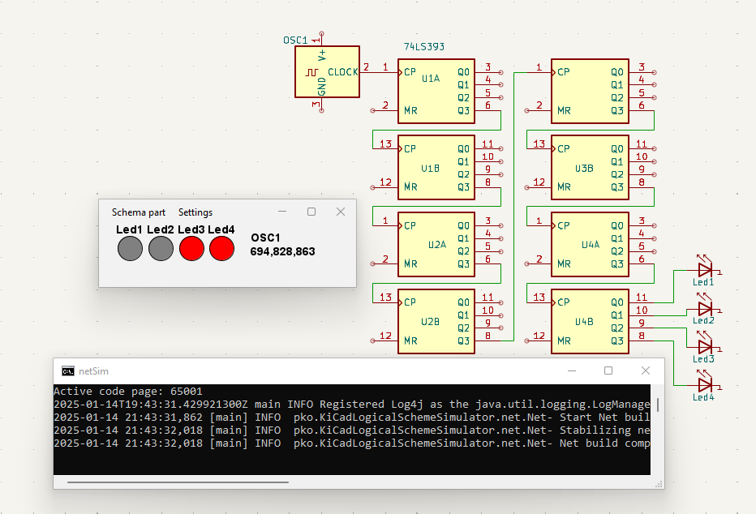
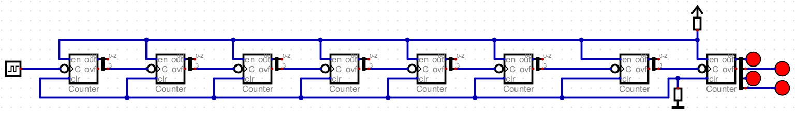

**Sequential counters with LED, ideal for speed test.**

On an Intel i-3770s, this schema achieved approximately 520 MHz.

For comparison, [Digital](https://github.com/hneemann/Digital) on the same hardware achieved approximately 90 times less speed.  
However, important to note that [Digital](https://github.com/hneemann/Digital) and this project have different schema building principles,
which may affect simulation speed.  
Additionally, this project provides real-time feedback on achieved frequency,
while [Digital](https://github.com/hneemann/Digital) doesn't offer this feature.
This leads to the necessity of using a clock for speed measurement in Digital, which is not very accurate.

