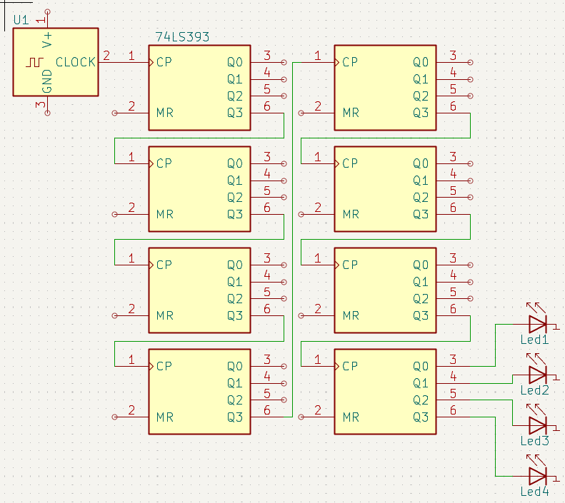

**Sequential counters with LED, ideal for speed test.**

On an Intel i-3770s, this schema achieved approximately 320 MHz.

For comparison, [Digital](https://github.com/hneemann/Digital) on the same hardware achieved approximately 50 times less speed.  
However, it is important to note that [Digital](https://github.com/hneemann/Digital) and this project have different schema building principles,
which may affect simulation speed.  
Additionally, this project provides real-time feedback on achieved frequency, while [Digital](https://github.com/hneemann/Digital) doesn't offer this feature.

