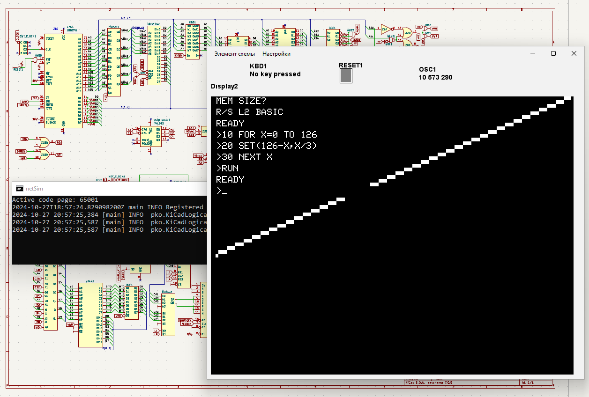

**Stripped TRS80-I Schema**

Simulator doesn't support any analog schema elements, so video and audio tape circuits cutted off.  
For proper simulation ROM dumps needed. Gradle task got it from public resources:  
BIOS: https://github.com/RetroStack/TRS-80-Model-I-System-ROMs  
CharGen: https://github.com/RetroStack/Character_Generator_ROMs

On an Intel i7-3770s processor, this schema achieved almost realtime speed.

for start use trs80 gradle task

```
./gradlew trs80
```


