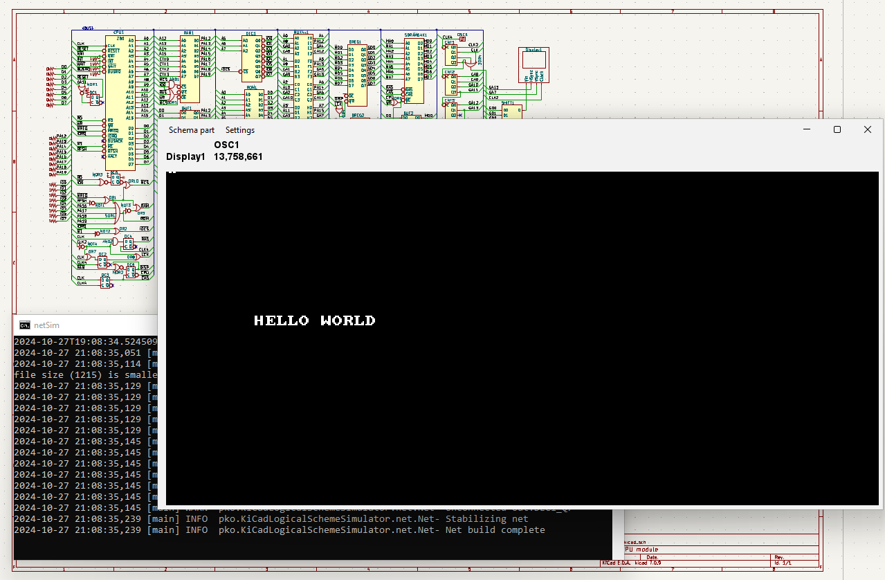

**Z80-based Schema Details:**

This schema contains a total about 80 parts, including:

- ~30 pull-up/pull-down resistors
- 20+ OR/NOR/AND/NOT gates
- 5 DC triggers
- 5 counters
- 4 registers
- 8-bit 4-way multiplexers
- 2 buffers
- 1 Zilog Z80 CPU
- 1 D-RAM
- 1 S-RAM
- 1 ROM
- 1 oscillator
- 1 decoder
- 1 shifter
- 1 display (providing 512x256 in monochrome)

On an Intel i7-3770s processor, this schema achieved about 13.7 MHz.  
Internally, the oscillator frequency divided by 4 for the CPU, but not for the video part and memory access,  
resulting the Z80 clocked at ~3.4 MHz.

I didn't find any reasonable competitor in which I can draw this schema as easily as I can in KiCad, and with decent simulation speed.

for start use z80 gradle task

```
./gradlew z80
```

